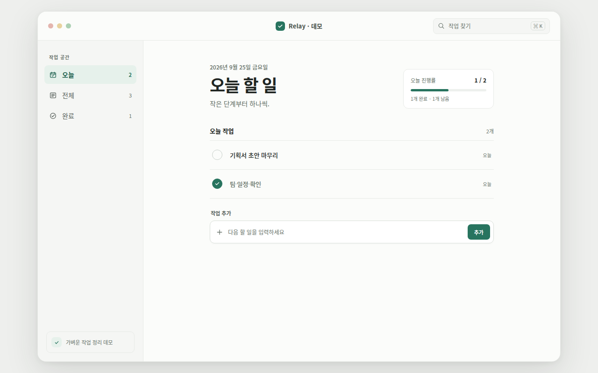
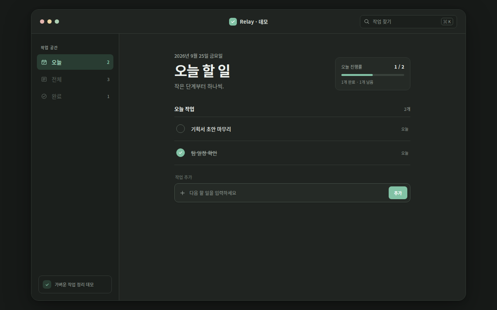
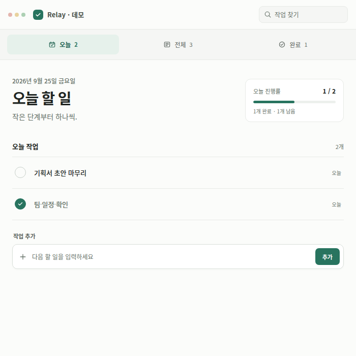

# UI/UX Skill

데스크톱 앱의 UI/UX를 설계하거나 검토할 때 쓰는 Codex 스킬입니다. Apple의 데스크톱 인터페이스 원칙을 바탕으로 작업 흐름, 시각적 위계, 접근성, 창 크기별 동작을 함께 다룹니다. SwiftUI/AppKit, Qt/QML, Flutter, 웹/Electron/Tauri 등 구현 환경을 먼저 고정하지 않아도 사용할 수 있습니다.

## 설계 기준

- **익숙한 데스크톱 동작:** 창 크기 조절, 사이드바, 툴바, 메뉴와 키보드 단축키를 과업에 맞게 배치합니다.
- **짧고 분명한 안내:** 불필요한 문구를 줄이되, 뜻이 모호한 아이콘에는 라벨·툴팁을 제공하고 오류 해결법은 남깁니다.
- **완결된 흐름:** 빈 화면, 로딩, 오류, 완료, 되돌리기까지 설계합니다. 반복 입력과 불필요한 모달을 줄입니다.
- **접근성과 검증:** 작은 창, 다크 모드, 큰 글자, 키보드, 스크린리더, 대비, 포커스, 움직임 줄이기를 확인합니다.

## 디자인 참고 자료

| 출처 | 활용 방식 |
| --- | --- |
| [Apple macOS HIG](https://developer.apple.com/design/human-interface-guidelines/designing-for-macos/) | 창·탐색·시스템 동작의 기준 |
| [Refero iOS Apps](https://refero.design/ios-apps) | 유사 과업의 화면 구성 탐색 |
| [Mobbin](https://mobbin.com/) | 추가·완료·탐색 등 사용자 흐름 비교 |
| [Uiverse](https://uiverse.io/) | 컨트롤 반응과 세부 시각 요소 참고 |

모바일 패턴은 데스크톱에 맞게 다시 설계하며, 참고 화면과 자산을 복제하지 않습니다.

## 파일 구성

- [SKILL.md](./SKILL.md): 상황에 따라 읽을 모듈을 안내하는 진입점
- [macos.md](./references/macos.md), [research.md](./references/research.md): 기본 원칙과 참고 자료
- [flow.md](./references/flow.md), [visual.md](./references/visual.md): 흐름과 시각 설계가 필요할 때
- [platforms.md](./references/platforms.md): 구현 환경으로 옮길 때
- [verify.md](./references/verify.md): 결과를 마무리하기 전 확인할 때
- [openai.yaml](./agents/openai.yaml): UI 표시 이름 `UI/UX Skill`

스킬 지침 Markdown 파일은 각각 300자 이내입니다. 필요한 모듈만 읽도록 나눠 문맥 사용량을 줄였습니다. 이 README는 사용 설명 문서이므로 해당 제한의 대상이 아닙니다.

## 설치와 사용

`SKILL.md`는 Codex와 Claude Code가 공통으로 읽는 형식(`name`·`description` frontmatter)입니다. 같은 저장소를 각 호스트의 스킬 폴더에 복제하면 됩니다. `agents/openai.yaml`은 Codex UI 표시용이며 Claude Code는 무시합니다.

### Codex

저장소를 Codex 스킬 폴더인 `$CODEX_HOME/skills/ui-ux-skill`에 복제합니다. `CODEX_HOME`을 지정하지 않았다면 `~/.codex/skills/ui-ux-skill`을 사용합니다.

```bash
git clone https://github.com/lsy041015/ui-ux-skill.git ~/.codex/skills/ui-ux-skill
```

요청에 `$ui-ux-skill`을 붙여 호출합니다.

예: “`$ui-ux-skill`을 사용해 할 일 관리 앱의 데스크톱 화면을 설계하고, 키보드와 작은 창 동작까지 검토해줘.”

### Claude Code

모든 프로젝트에서 쓰려면 사용자 스킬 폴더에, 특정 프로젝트에서만 쓰려면 프로젝트의 `.claude/skills/`에 복제합니다.

```bash
# 사용자 전역 (Windows: %USERPROFILE%\.claude\skills\ui-ux-skill)
git clone https://github.com/lsy041015/ui-ux-skill.git ~/.claude/skills/ui-ux-skill

# 또는 프로젝트 전용
git clone https://github.com/lsy041015/ui-ux-skill.git .claude/skills/ui-ux-skill
```

새 세션을 시작하면 스킬 목록에 `ui-ux-skill`이 나타납니다. Claude가 데스크톱 UI/UX 설계·검토 요청에서 자동으로 불러오며, 직접 호출하려면 `/ui-ux-skill`을 입력합니다.

예: “`/ui-ux-skill` 할 일 관리 앱의 데스크톱 화면을 설계하고, 키보드와 작은 창 동작까지 검토해줘.”

업데이트는 두 호스트 모두 복제한 폴더에서 `git pull`입니다.

## 적용 데모: Relay · 메모

작업 목록 데모에 오늘·전체·완료 탐색, 검색, 작업 추가·완료·되돌리기와 오늘 진행률을 구현했습니다. 넓은 창은 사이드바, 좁은 창은 가로 탐색으로 바뀝니다. 시스템 다크 모드와 움직임 줄이기 설정을 따릅니다. 작업 데이터는 페이지 메모리에만 있어 새로고침하면 초기 상태로 돌아갑니다.

### 기본 창



### 다크 모드



### 좁은 창


